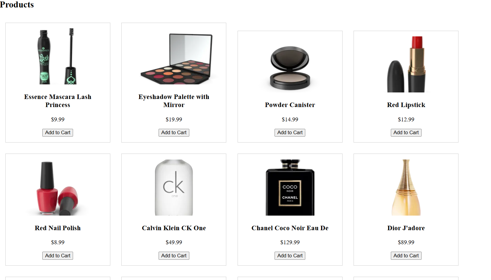

# 🛒 E-Commerce Frontend Application

## 📌 Project Overview

This is a fully functional frontend e-commerce application built using React. The application allows users to browse products, add items to the cart, and simulate a checkout process.

---

## 🚀 Features

* 🏠 Product Listing Page
* 🛍️ Add to Cart functionality
* 🧾 Cart Page
* 💳 Checkout Page
* 🔄 API Integration (DummyJSON API)
* ⚡ Responsive UI
* 💾 State Management using Context API

---

## 🛠️ Tech Stack

* React.js
* JavaScript (ES6+)
* Axios (API calls)
* React Router DOM
* Context API

---

## 📂 Folder Structure

```
src/
 ├── components/
 ├── pages/
 ├── contexts/
 ├── hooks/
 ├── services/
 ├── styles/
 ├── App.js
 ├── index.js
```

---

## ⚙️ Setup Instructions

1. Clone the repository:

```
git clone <your-repo-link>
```

2. Navigate to project:

```
cd ecommerce-app
```

3. Install dependencies:

```
npm install
```

4. Start the application:

```
npm start
```

---

## 🌐 API Used

* https://dummyjson.com/products

---

## 📸 Screenshots

### 🏠 Home Page



### 🛒 Cart Page


### 💳 Checkout Page


---

## 🧠 Architecture & Design

* Component-based architecture
* Context API for global state (Cart)
* Custom hooks for API handling
* Separation of concerns using services and hooks

---

## ⚡ Performance Optimizations

* Lazy loading (React.lazy)
* Optimized API calls
* Minimal re-renders using state management

---

## 🧪 Testing

* Manual testing of all features
* Verified cart functionality and checkout flow

---

## 🚀 Deployment

You can deploy this project using:

* Vercel
* Netlify

---

## 📌 Future Improvements

* 🔍 Search functionality
* ❤️ Wishlist feature
* 🌙 Dark mode
* 🔐 Real authentication

---

## 👨‍💻 Author

Your Name

---

## 🎉 Conclusion

This project demonstrates a complete frontend e-commerce workflow using modern React practices.

